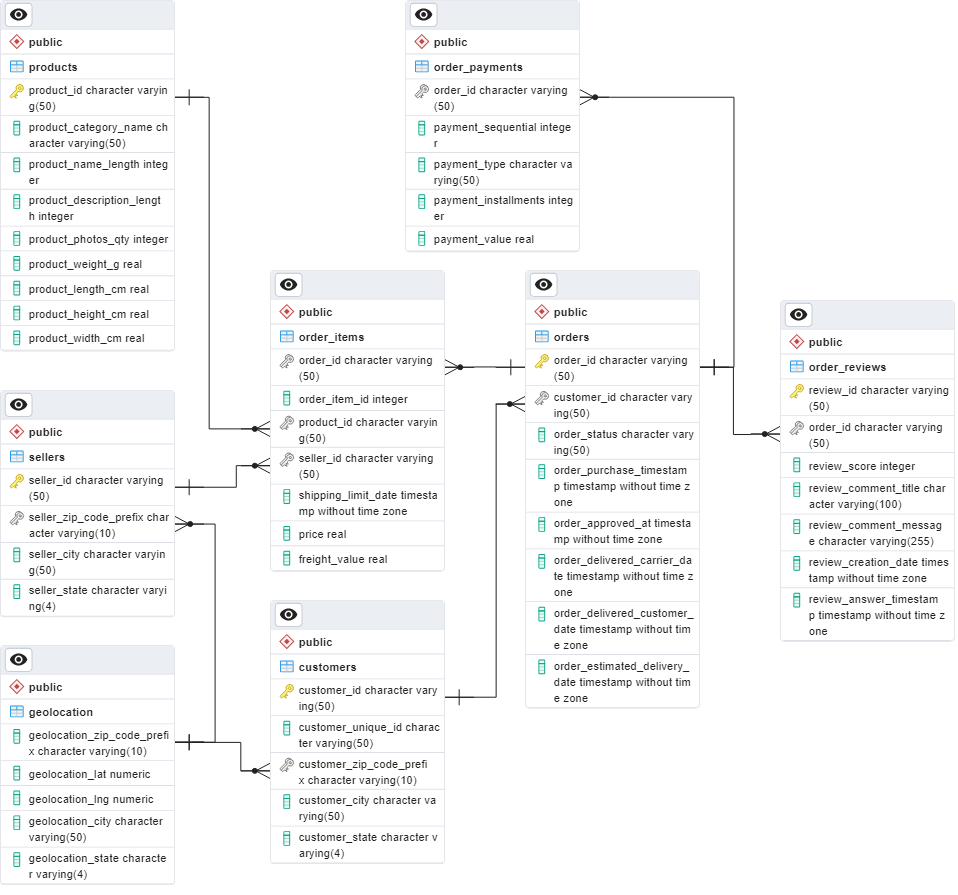
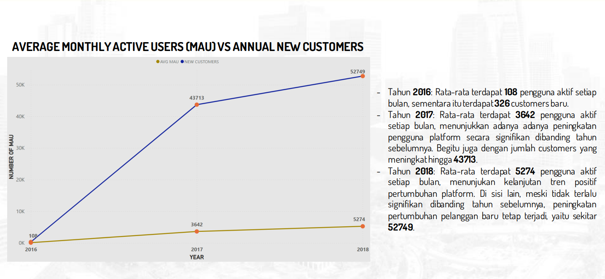
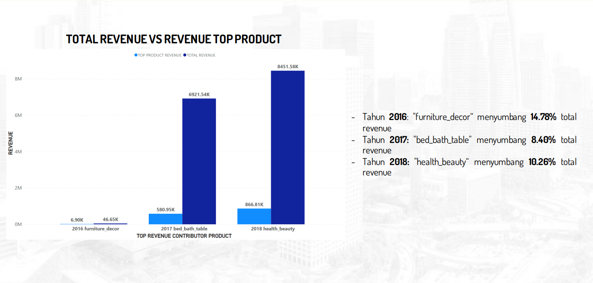
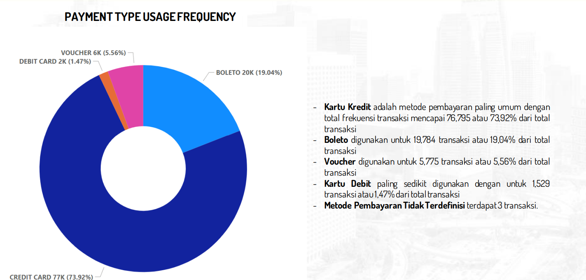

# ANALISIS KINERJA BISNIS E-COMMERCE DENGAN PENGGUNAAN SQL

## Study Case

Dalam proyek mini ini, saya memegang peran sebagai anggota tim Data Analytics di salah satu perusahaan e-Commerce terbesar di Amerika Selatan. Perusahaan ini bertugas menghubungkan pelaku bisnis mikro dengan pelanggan mereka. Tugas utama saya adalah melakukan analisis terhadap tiga aspek kunci terkait performa bisnis, yaitu pertumbuhan pelanggan, performa produk, dan metode pembayaran. 

## Objectives
1. data modelling
membuat ERD untuk menghubungkan data-data yang tersedia
2. melakukan query data untuk menghasilkan master table yangberisi data untuk menjawab pertanyaan bisnis
3. melakukan visualisasi data unutk melakukan analisis terhadap pertumbuhan pelanggan, kualitas produk, dan metode pembayaran
4. memberikan rekomendasi bisnis untuk meningkatkan performa bisnis ke depannya

## Data & Tools

1. **Data**
   - [Link to Data](https://github.com/aghulams/Analyzing-Ecommerce-Business-Performance-With-SQL/tree/main/Dataset)

2. **Tools**
   - PostgreSQL for data handling.
   - Power BI for data visualization.

## Results

### Queries
- [Link to Query Results](https://github.com/aghulams/Analyzing-Ecommerce-Business-Performance-With-SQL/tree/main/Query)

### Entity-Relationship Diagram (ERD)
- 

### Data Vizualitation

#### Customer's Growth
- 

#### Top Performing Products
- 

#### Most Canceled Products
- 

#### Monthly Used Payment Method
- 

## Business Recommendations

### 1. Focus on High-Revenue Products
   - Develop advertising campaigns highlighting unique features.
   - Collaborate with influencers to showcase product capabilities.
   - Create visually appealing content for online and offline channels.

### 2. Optimize Sales with Targeted Promotions Based on City
   - Offer discounts and free shipping in underperforming cities.
   - Cross-sell in high-performing cities with kits and ebooks.
   - Introduce a loyalty program for repeat orders.

### 3. Counteract Post-June Decline
   - Introduce time-sensitive promotions during the post-June period.
   - Plan strategic product launches or updates to maintain customer interest.
