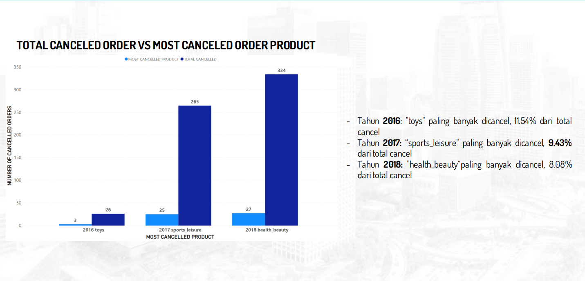

# BUSINESS PERFORMANCE ANALYSIS OF E-COMMERCE USING SQL

## Case Study

In this mini project, I played the role of a Data Analytics team member at one of the largest e-Commerce companies in South America. The company connects micro-businesses with their customers. My main tasks included analyzing three key aspects related to business performance: customer growth, product performance, and payment methods.

## Objectives

1. **Data Modeling:**
   - Created an Entity-Relationship Diagram (ERD) to connect available data.

2. **Data Querying:**
   - Executed SQL queries to generate a master table for answering business questions.

3. **Data Visualization:**
   - Conducted data visualization for analyzing customer growth, product quality, and payment methods.

4. **Business Recommendations:**
   - Provided business recommendations to enhance future business performance.

## Data & Tools

1. **Data:**
   - [Link to Data](https://github.com/aghulams/Analyzing-Ecommerce-Business-Performance-With-SQL/tree/main/Dataset)

2. **Tools:**
   - PostgreSQL for data handling.
   - Power BI for data visualization.

## Results

### Queries
- [Link to Query Results](https://github.com/aghulams/Analyzing-Ecommerce-Business-Performance-With-SQL/tree/main/Query)

### Entity-Relationship Diagram (ERD)
- 

### Data Visualization

#### Customer's Growth
- 

#### Top Performing Products
- 

#### Most Canceled Products
- 

#### Monthly Used Payment Method
- 

## Business Recommendations

### Customer Growth

1. **Optimize User Experience:**
   - Ensure the website or app is user-friendly with intuitive design and clear navigation.
   - Optimize responsiveness across devices for an optimal user experience.

2. **Data-Driven Marketing:**
   - Utilize customer data for personalized marketing messages.
   - Analyze data to identify market trends and opportunities.
   - Leverage analytics and AI for effective marketing strategies.

3. **Loyalty and Reward Programs:**
   - Develop loyalty programs with discounts, reward points, or exclusive benefits to encourage customer retention.

4. **Personalized Customer Experience:**
   - Create personalized experiences based on customer preferences through targeted marketing strategies or customer behavior identification technology.

5. **Customer Feedback and Surveys:**
   - Collect customer feedback to gain valuable insights for product, service, and transaction process improvements.

### Product Performance

1. **Diversify Product Portfolio:**
   - Continuously diversify products as top revenue categories may vary each year.
   - Identify new market trends and opportunities for product line expansion.

2. **Focus on High-Growth Categories:**
   - Explore other high-performing categories alongside the top product to maximize revenue potential.

3. **Maintain Product Quality in "health_beauty":**
   - Focus on maintaining or improving the quality of products in the "health_beauty" category to reduce cancellations and ensure customer satisfaction.

4. **Analyze Cancellation Reasons:**
   - Understand the reasons behind cancellations to reduce the number of canceled products.

5. **Improve Delivery Process and Customer Service:**
   - Ensure efficient and responsive delivery processes and customer service to provide a good experience.

### Payment Methods

1. **Promotional Campaigns for Specific Payment Types:**
   - Collaborate with payment method issuers for promotional campaigns to increase the use of specific payment types.

2. **Payment Education:**
   - Provide additional information or guides on effectively using each payment method.

3. **Transaction Security Enhancement:**
   - Ensure high-security levels for all payment methods to avoid fraud or security risks.

4. **Integration of Additional Payment Methods:**
   - Consider adding more payment options popular in specific regions or countries.

5. **Customer Surveys and Feedback:**
   - Gather feedback from customers about their experiences with payment methods to make necessary improvements or adjustments.
